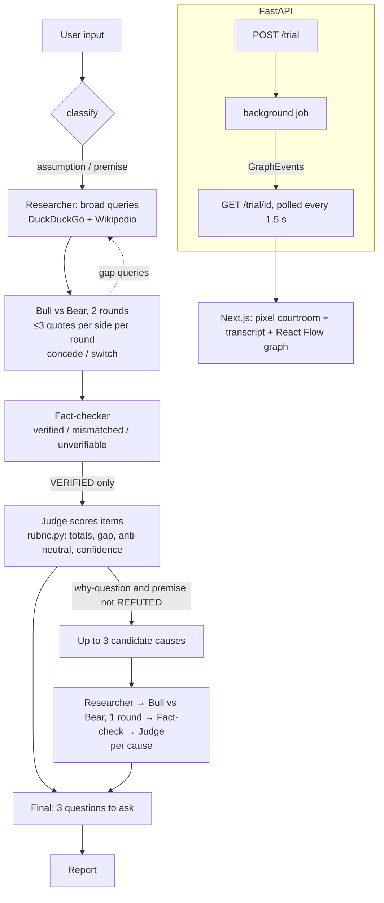

# ⚖️ Assumption Court

**Five AI agents put a business assumption on trial.** A Researcher retrieves sources, a Bull and a Bear argue using
only **verbatim retrieved quotes**, a Fact-checker throws out any claim its quote doesn't support, and a Judge scores
what is left with a fixed rubric. You watch it happen: pixel agents walk up, argue, concede and get overruled, and every
exhibit lands on an evidence graph.

## Why it matters

People make big bets on untested assumptions ("D2C brands fail because of ads"). Ask a single AI and it usually
accepts the premise, sounds confident, and invents numbers. The Court is built the other way round:

- **Grounding is the thesis.** Every claim must cite a retrieved quote. A quote that doesn't support its claim is marked
  **UNVERIFIED** and removed from scoring (it stays visible, greyed out).
- **Code, not the model, does the arithmetic.** The Judge scores each item's source tier and recency; `rubric.py` computes
  totals, the gap, confidence, and an **anti-neutral rule** (a decisive gap cannot end in "inconclusive").
- **Honest evaluation.** A single-prompt baseline with the *same model and the same retrieval budget*, and a published
  "where the Court loses" section.

## Research basis (an implementation, not a novel method)

| Paper | Used for |
|---|---|
| Irving, Christiano & Amodei, *AI Safety via Debate* (2018), https://arxiv.org/abs/1805.00899 | Two opposing debaters plus a judge |
| He et al., *DebateCV* (2025), https://arxiv.org/abs/2507.19090 | Bull vs Bear + a judge weighing evidential strength; countering its neutral-verdict bias |
| *PROClaim* (2026), https://arxiv.org/abs/2603.28488 | Courtroom roles, progressive retrieval, evidence admission rules, role-switching |

Product additions (not research claims): premise and cause trials, the quote-level fact-checker, UNVERIFIED badges, the
rubric, "what would change the verdict", "3 questions to ask" and the live courtroom UI.

## Architecture



- Backend: `backend/app/` (FastAPI, LangGraph pipeline in `app/pipeline/`, prompts in `backend/prompts/*.md`, every
  LLM call logged to `backend/logs/llm_calls.jsonl`).
- Frontend: `frontend/` (Next.js App Router + React Flow + Tailwind). One paced playback queue turns the event stream
  into the courtroom scene, the transcript and the evidence graph at the same time.

## Run locally

Prerequisites: Python 3.11, Node 20+.

```bash
cp .env.example .env            # add GEMINI_API_KEY + GEMINI_MODEL (from Google AI Studio)
python3.11 -m venv .venv && . .venv/bin/activate
pip install -r backend/requirements.txt
cd backend && uvicorn app.main:app --reload --port 8000        # terminal 1

cd frontend && npm install && npm run dev                      # terminal 2 → http://localhost:3000
```

**Backup AI provider.** Free tiers get overloaded. Set `LLM_FALLBACK_PROVIDER=openai_compat` plus the three
`OPENAI_COMPAT_*` values in `.env` to hand calls to any OpenAI-compatible API (e.g. Groq or OpenRouter) whenever
Gemini is busy or out of quota. You can also make it the main provider with `LLM_PROVIDER=openai_compat`.

No key yet? Run the whole thing offline with deterministic stand-ins (verdicts are meaningless, the UI says so):

```bash
cd backend && LLM_PROVIDER=fake RETRIEVAL_PROVIDER=fake uvicorn app.main:app --port 8000
```

Tests: `cd backend && pytest -m "not network and not llm"` (offline), `pytest -m network` (live retrieval),
`pytest -m llm` (needs a real key).

Regenerate the cached demo trials with a real model: `cd backend && python scripts/generate_cached_cases.py`.

## Evaluation

> **Not run yet.** The harness is built and tested; the full run needs a real key and is rate-limited, so it is done by hand.

```bash
python eval/fetch_fever.py                       # 100 FEVER claims, stratified 34/33/33, seed 42
# label eval/data/business_30.jsonl yourself (label: SUPPORTED | REFUTED | INCONCLUSIVE)
python eval/run_eval.py --dataset fever --limit 10   # smoke run; tune JUDGE_DECISIVE_GAP here only, then: git tag eval-v1
python eval/run_eval.py --all                    # full 130; resumable, just re-run after interruptions / 429s
python eval/run_eval.py --summary
python eval/grade_citations.py                   # citation quality + eval/manual_check.csv (20 pairs to check by hand)
```

| Dataset | Arm | N | Accuracy | INCONCLUSIVE rate | Avg LLM calls |
|---|---|---|---|---|---|
| FEVER | Court | 100 | _tbd_ | _tbd_ | _tbd_ |
| FEVER | Baseline | 100 | _tbd_ | _tbd_ | _tbd_ |
| Business | Court | 30 | _tbd_ | _tbd_ | _tbd_ |
| Business | Baseline | 30 | _tbd_ | _tbd_ | _tbd_ |

### Where the Court loses

_To be filled in honestly after the full run: the cases where the one-prompt baseline beat the Court, and why._

Details and setup: [`eval/report.md`](eval/report.md).

## Cost per case

The number of LLM calls is set by the pipeline's structure (measured with the offline stand-in): about **21 calls** for a
plain assumption (classify, 2 research plans, 4 debate turns, ~11 fact-checks, 1–2 judge calls, questions) and about
**50** for a why-question with three cause trials. Fewer calls happen when a side concedes. Tokens, seconds and cost per
case will be measured with the real model during the evaluation run. The baseline uses exactly **1** LLM call.

---
*Built by Amiya Manas Singh: Paper → Product series.*
